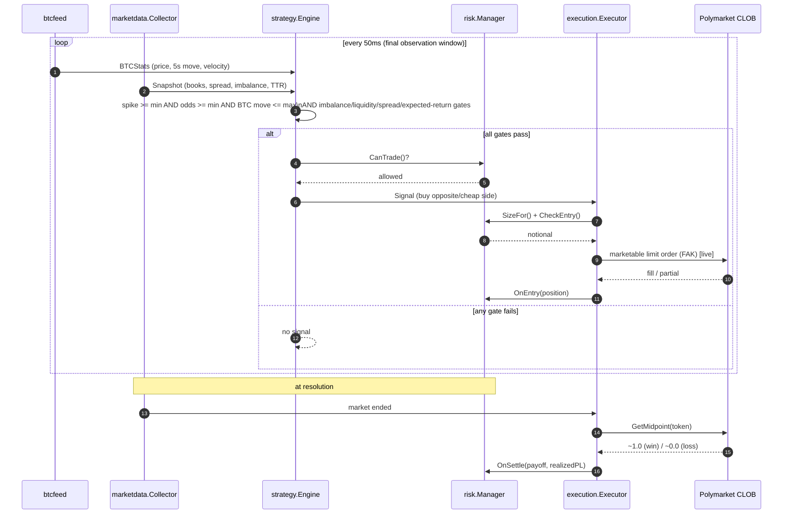

# Architecture

`livepolybtc` is organized as a set of single-responsibility packages wired
together by `internal/app` into cooperating goroutines that communicate over
channels and mutex-guarded shared state. A single root `context.Context`
cancels every goroutine for graceful shutdown.

## Component diagram

```
                        ┌──────────────────────────────────────────────┐
                        │                  cmd/bot                      │
                        │  load config • build Bot • signal handling     │
                        └───────────────────────┬───────────────────────┘
                                                 │
                                       ┌─────────▼─────────┐
                                       │   internal/app     │
                                       │   (orchestrator)   │
                                       └─┬───┬───┬───┬───┬──┘
        ┌──────────────────┬─────────────┘   │   │   │   └──────────────┐
        │                  │                  │   │   │                  │
        ▼                  ▼                  ▼   │   ▼                  ▼
┌───────────────┐  ┌───────────────┐  ┌───────────────┐  ┌───────────────┐
│  btcfeed      │  │  marketdata   │  │   strategy    │  │     risk       │
│ Coinbase/     │  │ discovery +   │  │ overreaction  │  │ limits, sizing,│
│ Binance/      │  │ ws + polling  │  │ fade engine   │  │ kill switch    │
│ Kraken stats  │  │ collector     │  │ (50ms eval)   │  │ bankroll/expo  │
└──────┬────────┘  └──────┬────────┘  └──────┬────────┘  └──────┬─────────┘
       │ BTCStats         │ Snapshot         │ Signal            │ gate/size
       │                  │                  │                   │
       └──────────────────┴────────►  signals chan ──────────────┤
                                                                  ▼
                                                        ┌───────────────┐
                                                        │   execution    │
                                                        │ marketable LO, │
                                                        │ retries, fills,│
                                                        │ simulation     │
                                                        └──────┬─────────┘
                                                               │ OrderRequest
                                                               ▼
                          ┌───────────────┐          ┌───────────────────┐
                          │   auth (HMAC) │◄─────────│   api (REST)       │
                          │  L2 signing   │          │ CLOB + Gamma client│
                          └───────────────┘          └───────────────────┘

   Cross-cutting:  logging (leveled + CSV/JSON event recorder),
                   models (shared domain types),
                   config (YAML schema + validation),
                   backtest / optimize (offline replay & search).
```

## Goroutines (channels & shared state)

| Goroutine          | Responsibility                                                        | Inputs                | Outputs                  |
|--------------------|-----------------------------------------------------------------------|-----------------------|--------------------------|
| `btc-feed`         | Poll exchange, maintain velocity/volatility/move stats                | exchange REST         | `BTCStats` (shared)      |
| `market-lifecycle` | Discover active market, run collector for its lifetime, roll over     | Gamma API             | active market (shared)   |
| `strategy`         | Build snapshot every 50ms, evaluate gates, emit signals               | collector + BTC stats | `signals` channel        |
| `execution`        | Size, risk-gate, execute signals; track fills; open positions         | `signals` channel     | orders, positions        |
| `settlement`       | Resolve positions after expiry, update risk accounting                | midpoint/book         | settled P&L              |
| `health`           | Heartbeat; watch feed staleness & ws connection                       | collector/feed/risk   | log/event heartbeats     |

Shared state is mutex-guarded (`marketdata.Collector`, `risk.Manager`,
`btcfeed.Feed`). The strategy engine is confined to its own goroutine and is
reset on each market rollover.

## Entry decision sequence



## Failure handling

- **API errors** — retried with exponential backoff for transient (5xx/429)
  failures; non-retryable errors surface immediately.
- **Websocket** — auto-reconnects with exponential backoff; REST polling acts
  as a continuous backstop so data never fully stalls.
- **BTC feed** — tolerates fetch errors and flags `Stale`; the strategy refuses
  to fire on stale data.
- **Panics** — isolated per goroutine and trip the kill switch.
- **Shutdown** — `Ctrl-C`/SIGTERM cancels the root context; the bot drains,
  cancels resting orders (live), and exits.
